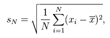

# Introduction to Computer Science and Programming
## Lecture 15

### Probability (continued)
How can we know how many flips of a coin are necessary to be representative of the true probability? (i.e., How many samples are needed to have confidence in the result?) *Variance* is the measure of how much spread exists in the possible outcomes. To do this, we must have multiple outcomes. Performing multiple trials of smaller samples (as opposed to one large sample) allows you to obtain/observe its variance.

Variance is measured in *standard deviation*. The standard deviation is the fraction of the values close to mean, relative to the mean.

A graph of the standard deviation of heads and tails is dropping.

The *coefficient of variation* is the standard deviation divided by the mean (relative variance). It allows you to compare tests of different sample sizes. If it's <1, it's low variance. Low means can skew the coefficient. They cannot be used for confidence intervals.

In graphs, 100000 trials of 100 flips each vs. 100000 trials of 1,000 flips each: means are similar (0.500 +/- .001); standard deviation much lower (0.04 vs 0.01). A *normal distribution* peaks at the mean and falls of symmetrically (looks like a bell curve). Normal distributions have nice mathematical properties and many naturally occurring examples.

The confidence intervals allows us to provide a range likely to contain the unown value and confidence level the value lies with the range (e.g., 52% +/- 4%). (If unspecified, confidence interval is 95.) In 95% of elections, the results will lie between 48%-56%. The assumption is that the distribution is normal.

The *empirical rule* states if we have a normal distribution: 68% of data will be within 1 standard deviation. 95% will be within 2 standard deviations. 99.7% are within 3.

The *standard error* is an estimate of the standard deviation (assumes normal distribution).

	P = % sampled
	n = sample size
	standard error = ((P * (100 - P) / n))**0.5